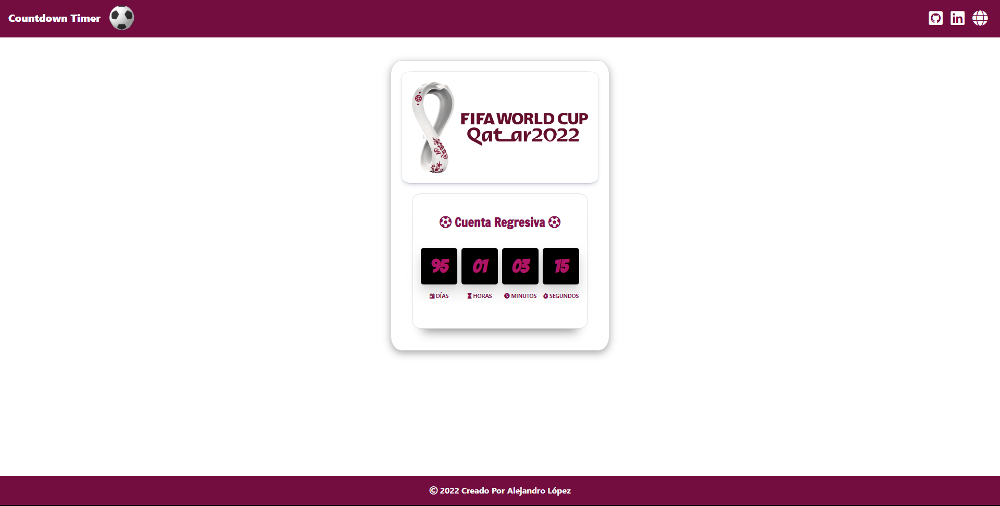

# <h1 align="center" style="color: #80cbc4;"> Countdown Timer 👨🏻‍💻 </h1> 
  

¿What is a `Countdown Timer`?    
It is an easy-to-use tool that allows you to see a countdown clock that shows how much time is left between the current moment and the selected specific event, indicating the specific day, hour, minute and second.    

  

## 
 Requirements 

- [HTML5](https://developer.mozilla.org/es/docs/Web/HTML) 
- [CSS3](https://developer.mozilla.org/es/docs/Web/CSS)
- [JavaScript](https://developer.mozilla.org/es/docs/Web/JavaScript)

  

## 
 Screenshot Project 💻 

🔶 [Project Website](https://alejandro-lopez.futuretecware.com/Countdown-Timer-Qatar/index.html)

